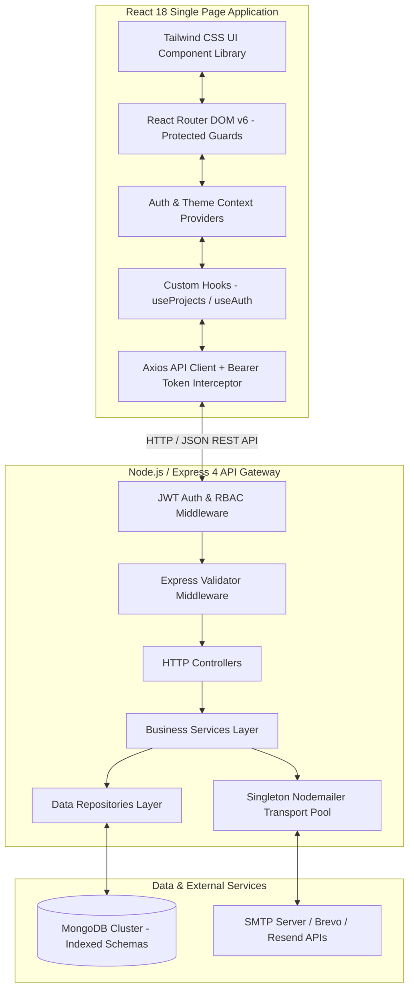
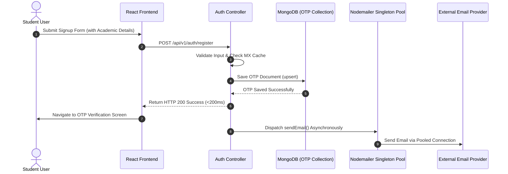

# System Architecture & Design Specification

The **Student Project Management System** is built on an enterprise full-stack architecture designed for academic collaboration, guide allocation, milestone tracking, and system oversight.

---

## 🏗️ High-Level Component Overview

---

## ⚡ High-Performance Architecture Strategies

### 1. Sub-200ms Student Signup & OTP Pipeline

### 2. Singleton SMTP Transporter Pool (`pool: true`)
- **Connection Reuse**: Avoids recreating Nodemailer instances and negotiating new TLS/SMTP handshakes on every registration request (`maxConnections: 5`, `maxMessages: 100`).
- **Domain MX Cache**: Caches domain MX lookup results in `domainMxCache` map to eliminate redundant 3-second DNS timeouts during email deliverability verification.

### 3. Database Query Optimization & Compound Indexing
- **Compound Indexes**:
  - `User ({ role: 1, status: 1 })` and `User ({ createdAt: -1 })` for instant role/status filtering.
  - `Project ({ status: 1, updatedAt: -1 })` and `Project ({ members: 1 })` for indexed status scans.
  - `Notification ({ user: 1, read: 1, createdAt: -1 })` for fast unread notifications lookup.
- **Admin Dashboard Query Acceleration (<400ms)**: Passes `{ limit: 5 }` and `select` parameters to fetch light datasets on initial load instead of scanning full collections.

---

## 🔐 Security Architecture

- **Authentication**: Stateless JWT session management with expiration tokens.
- **Authorization**: Strict Role-Based Access Control (RBAC) enforced via `roleMiddleware.js` across `student`, `faculty`, and `admin` roles.
- **Super Admin Immutability**: Hardcoded protection preventing demotion or deletion of the primary system Super Admin account.
- **Data Protection**:
  - **Password Security**: Bcrypt with adaptive salt rounds; password hashes excluded from API serialization (`select: '-password'`).
  - **Secure HTTP Headers**: **Helmet.js** integration to mitigate web security risks.
  - **Rate Limiting**: Brute-force protection via `express-rate-limit`.
- **Auditability**: Security actions logged to **Audit Logs** (`action`, `user`, `ip`, `timestamp`).

---

## 🚀 Scalability & Maintainability

- **Stateless API Gateway**: Stateless Node.js backend suitable for horizontal scaling behind load balancers.
- **Layered Clean Architecture**: Strict separation of concerns (Controllers → Services → Repositories → Models) simplifies unit testing, refactoring, and data persistence updates.
