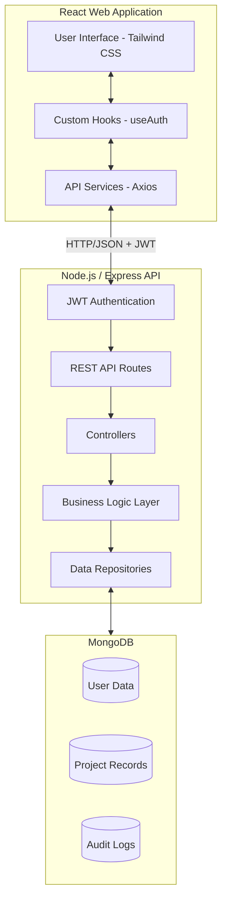

# System Architecture Design

The **Student Project Management System** is built on a modern full-stack architecture designed for academic collaboration and oversight.

## 🏗️ High-Level Overview

## 🔐 Security Architecture

- **Authentication**: JWT-based session management with encrypted token storage.
- **Authorization**: Strict Role-Based Access Control (RBAC) across all protected endpoints.
- **Data Protection**:
  - **Password Hashing**: Bcrypt with adaptive salt rounds.
  - **Secure Headers**: Implementation of **Helmet.js** to mitigate common web vulnerabilities.
  - **Rate Limiting**: Protection against brute-force attacks via `express-rate-limit`.
- **Auditability**: Comprehensive logging of critical system actions (logins, deletions, status changes) in the **Audit Logs**.

## 🚀 Scalability Considerations

- **Stateless API**: The backend is stateless, allowing for horizontal scaling behind a load balancer.
- **Lazy Loading**: Frontend uses React memoization and code-splitting to maintain performance as the project repository grows.
- **Layered Design**: The strict separation between business logic (Services) and data access (Repositories) allows for easier unit testing and future-proofing.
